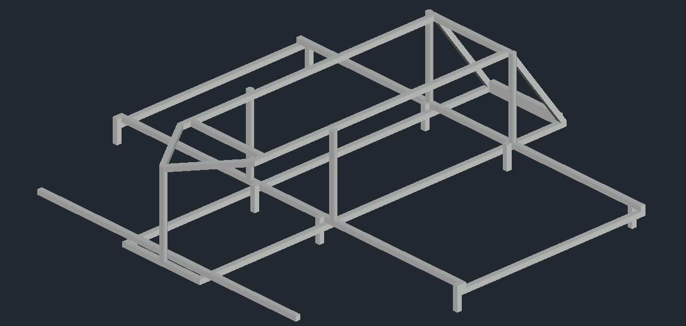
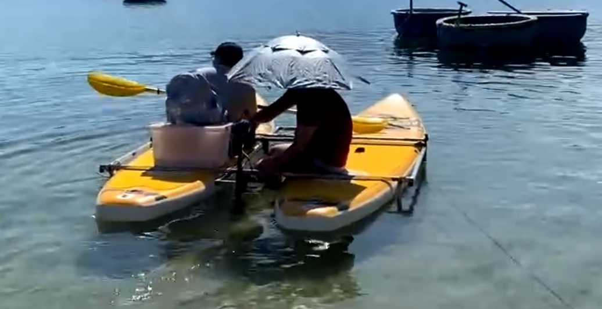

# Mechanical_boat_v1
## File .dwg using freecad / Autocad

- Body farme use stainless steel square frame 25mm, thickness 1.2mm.
- Use 2 SUP Boats attached to the frame to create a catamaran.
- The advantage of a catamaran is its excellent stability.

## .../Cad/Boat_v1.dwg

## Testing

